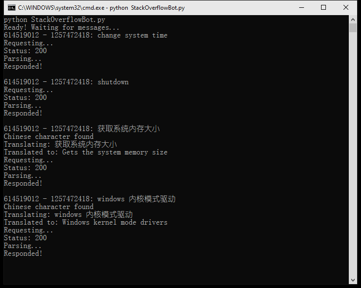
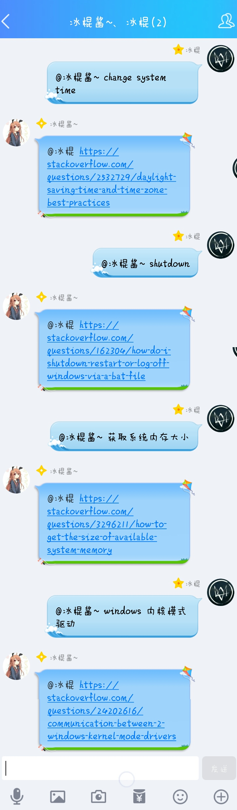

# QQ_StackOverflow_Bot
从StackOverflow上搜索资料的QQ聊天机器人

# 功能
1. 根据消息自动前往Stack Overflow搜索相关的内容，按照相关程度排序，并拉取第一条链接。
2. 若检测到消息里面有中文，则先调用有道词典API把内容翻译成英文，再进行搜索。

# 准备
1. 安装酷Q和酷Q的HTTP API插件
2. 安装依赖的python库
3. 把YoudaoTranslateAPI.py里面有关的key替换成您的key以使用中文翻译功能

# 效果

 控制台界面  

 聊天界面  

# 啰嗦话
这是我第一次尝试弄QQ机器人，以及用python解析网页信息。挺有意义的 :)

非常感谢亲爱的阳光加冰把他的有道词典API key给我用来测试~ 爱你哦 （づ￣3￣）づ╭❤～
